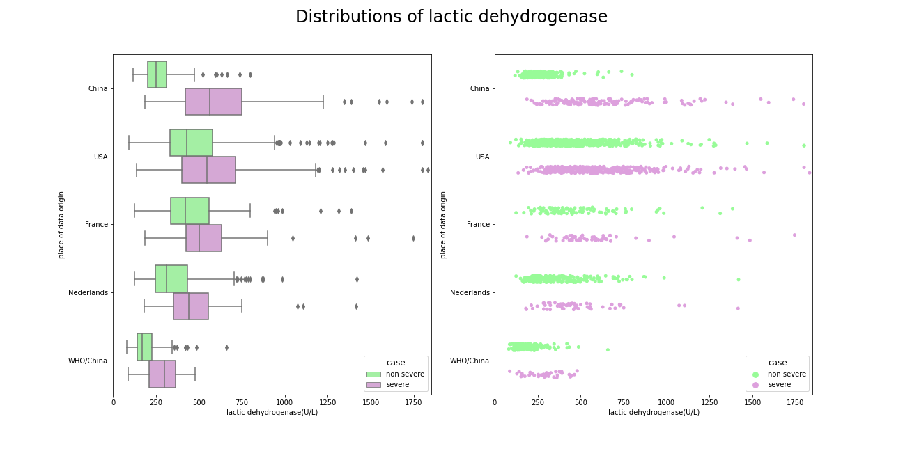
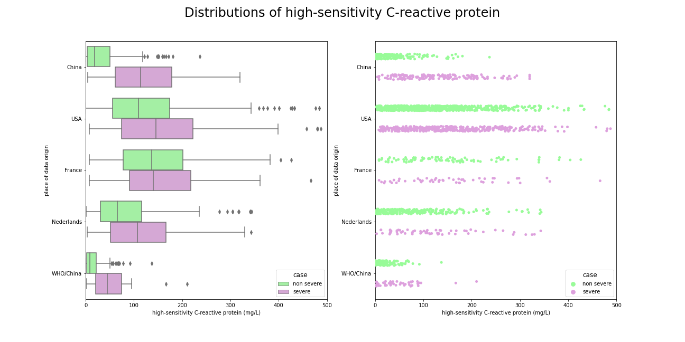
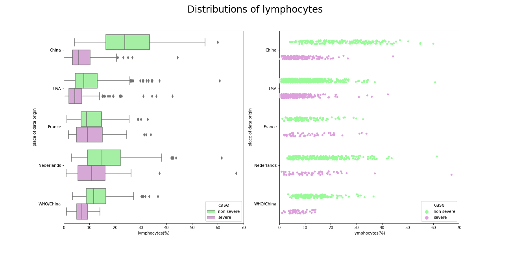
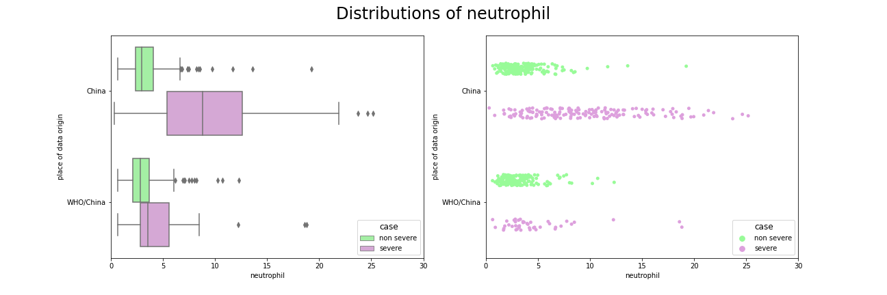
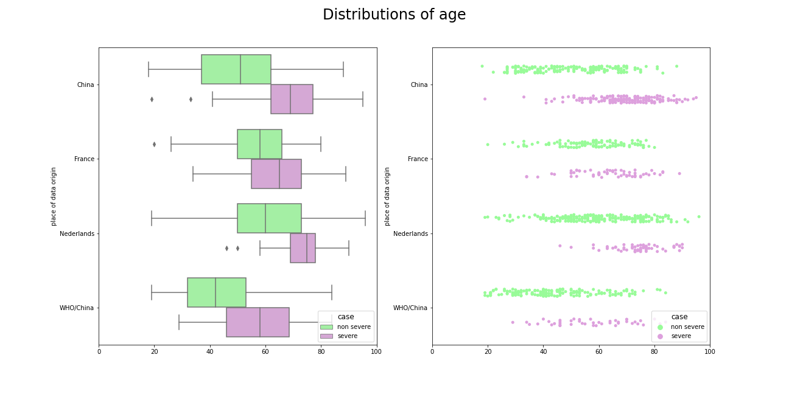

## Data description

We have begun our work from analyzing article [china], authors have created a model based on blood samples collected form 375 patients from the Wuhan region in the first quarter of 2020. Data from another 110 patients were treated as an additional test set. Dataset contains 81 variables, including 74 describing the blood tests results, but not all tests were performed on each patient. Scientists finally created a model based on three variables: lactic dehydrogenase, lymphocytes and high-sensitivity C-reactive protein, these are going to be crucial also in our work.

The article [china] received several replies, scientists from the USA, France and the Netherlands validated the model on datasets from hospitals from their home countries. The results pointed to the problem of rashly predicting death for patients who eventually survived Covid-19 infection. They also claimed that the [china] model learning from most recently performed  measurements was not an appropriate tool to prioritize ICU admissions and should therefore use results from first tests.

The datasets from corresponding articles contained 3 previously highlighted features, in datasets from [france] and [usa] there are multiple test results and other useful features such as age, but information about other blood components is not included. The data from [usa] was especially helpful, the data was shared to us after consultation with one of the article's authors. The data came from Northwell Health, New York State's largest hospital network serving 11 million patients and contained 1038 records.

Table 1 contains all most important information about each of datasets and shows which of them contains features needed to create models.

| Article         | Records | Variables | Lactate Dehydrogenase| High reactive C protein | Lymphocytes    | Neutrophil | Age |
|-----------------|:-------:|:---------:|:-------------------:|:-----------------------:|:--------------:|:----------:|:---:|
|[china]          |485      |81         | Yes                 | Yes                     | Yes            | Yes        | Yes |
|[usa]            |1038     |14         | Yes                 | Yes                     | Yes            | No         | No  |
|[nederlands]     |305      |15         | Yes                 | Yes                     | Yes            | No         | Yes |
|[france]         |178      |43         | Yes                 | Yes                     | Yes            | No         | Yes |
|[new]            |601/214  |66/33      | Yes                 | Yes                     | Yes            | Yes        | Yes |

Careful inspection of distributions of these key variables from various articles helps to understand problem with applying model form [china] on dataset from corresponding articles.

Lactic dehydrogenase was the most important feature in model from [china], relying only on its value patients were supposed to be directed to the ICU. The chart shows that indeed distribution of sever cases is significantly shifted towards higer values in comparsion with non severe cases, but such a large difference does not occur in other datasets, patients requiring additional care usually have an increased lactic dehydrogenase, but not as much as patients from China. An interesting dependence ocuurs in the dataset from [new], a large part of the data also comes from China, there is a great distinction between the severely and slightly ill, but the overall lactic dehydrogenase levels are much lower. Additionally, slightly ill patients from Europe and the US have higher LDH levels than severely ill patients from China.

A similar situation occurs when it comes to high-sensitivity C-reactive protein (CRP), in the dataset from [china] the distributions are clearly shifted among themselves, but similar dependency occurs only in the data from [new]. Patients suffering from the virus slightly and severely from other countries with have less varied level of CRP.

The same dependence occurs with lymphocytes, one additional fact about these distributions is that French do not have lower level of these cells as do patients from rest of the world.

Neutrofil was not used in [china] model, but it separates sever and non-severe cases in both datasets very well.

Age is also crucial feature in predicting virus severity, the young people get sick more mildly than the old ones.

